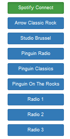

# fono - Internet Radio Player and Spotify Connect Client

`Fono` is a Rasberry Pi internet radio and Spotify client application.
This service is made available via an http server, so that it can be
controlled via a browser on the local network. It works nice on a
smartphone.

Spotify functionality requires Spotify Premium.

Note that Spotify is not really controlled by this app. That is,
Spotify is just playing happily continuously. Selecting Spotify in the
menu only stops playing a radio stream. You have to pause the Spotify
source if you want to listen to the radio, or you will hear both.

# Installation
This note is assuming that you are using a Raspberry Pi running
Raspbian.  It is partly written as a "note to self", to avoid looking
up stuff time and time again.

`Fono` is tested on Rasbian 9 (stretch), it will (or can be made
to) work on many other systems, including OSX.

The `fono` program uses `mplayer` and `raspotify`. 

## Get `fono`
This player currently has no install procedure, it is recommended to
install into some local directory, e.g. in a subdirectory of your home
directory.

    git clone <fono repository> <installdir>

Then, `cd` into the `<installdir>` directory. It is assumed that the
rest of the installation is done from that directory (although that is of
course not needed for the installation of the `mplayer` and
`raspotify` prerequisites).

## Install mplayer

    sudo apt-get install mplayer

On RPI/Raspbian, you might need to add the fono user to audio group.
Otherwise, only root can play audio.

    sudo adduser <username> audio

On RPI/Raspbian,  you should probably select headphone jack for
output. Do this with the `amixer` command.  The last argument `1` selects
headphone jack. Otherewise, 2 selects HDMI and 3 would select both jack
and HDMI simultaneously.

    amixer cset numid=3 1

## Install raspotify
Info: see https://github.com/dtcooper/raspotify. 

    curl -sL https://dtcooper.github.io/raspotify/install.sh | sh

## Install python prerequisites
Subsequently, install the python prerequisites. Note that `fono` is
packaged to to use `venv`, which avoids potentially messing up your
python installation.  If you don't have `venv` installed already, run

    sudo apt-get install python3-venv

Then, make a suitable virtual environment, activate it and install. `pip
install` will currently install `Flask`, `psutil`, `gunicorn` and
`Flask-Bootstrap` and their dependencies.

    python3 -m venv venv
    source venv/bin/activate
    pip install -r requirements.txt

## Configuration
Configuring radio stations: see `fono/routes.py`

For configuring the port on which the fono server runs, you should edit
`gen_init_file.py`, and edit the `fonoport` parameter. The default
value is 8000, meaning that you can access the service via
`http://localhost:8000` on the machine that you have installed `fono`
on, or the IP address of that machine on your local network.

## Run `fono` manually
In the activated environment, just type

    python fono.py

Logging is to the console.

## Prepare for `fono` to start upon booting
Fono can also be run as a `systemd` service, to start upon booting.
For that, you have to install a so-called `service` file that contains
the necessary information for `systemd`. The `fono` package contains a
script that generates such a `fono.service` file.  You need to run
that in the directory where you installed `fono`, in particular in the
directory where you find the `gen_init_file.py` script. Do there as
follows:

    python gen_init_file.py > fono.service

Install the service, assuming `/etc/systemd/system` to be the the
designated place on raspbian/debian:

    sudo mv fono.service /etc/systemd/system 

Enable and start the service:

    sudo systemctl enable fono
    sudo systemctl start fono

Other useful systemctl commands may be `stop`, `restart` and
`disable`. The `enable` and `disable` commands are for controling boot
behavior, `start`, `restart` and `stop` are for manual control. You
might appreciate manual control if you change the configuration, e.g.
the station list. You might want to use `sudo systemctl status fono`
for having some feedback.

Logging in this case is to `/var/log/syslog`. If desired, logging can
be configured differently in `fono.service`.

# Technical notes
`Fono` generates a socket named `mplayer-fifo.sock` in `/tmp`.

# Amixer

For controling volume on raspberry pi

    amixer   # to find name of audio device, will probably be 'PCM'
    amixer sset PCM 90% # set PCM volume to 90%

# TODO
In no particular order.

- have the mplayer socket in `/var/run` rather than `/tmp`.
- really control Spotify
- implement a button interface for physical buttons (to build a nice
  player box)
- install procedure using a `setup.py`
- include volume control
- ajax so that all browsers show correct state if multiple of them are
  used to control the same `fono` instance.

NvdM
